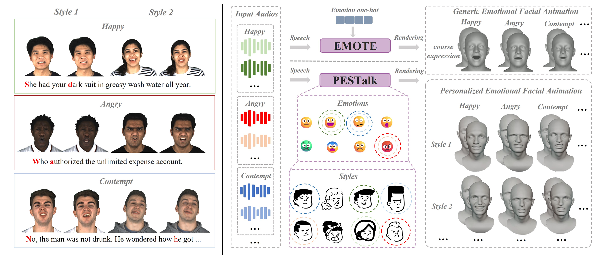

# PESTalk: Speech-Driven 3D Facial Animation with Personalized Emotional Styles [ACM MM 2025]


 

> While prior work treats emotion as one-hot embeddings, producing averaged facial expressions that ignore the personalized emotional styles influenced by habitual behaviors and cultural backgrounds, PESTalk dynamically selects optimal expressions by analyzing emotions and voiceprints to generate realistic 3D animations with personalized styles.


## Demos
<video src="https://github.com/user-attachments/assets/18f38f82-508e-4ea5-952f-560745398f0b" controls="controls" width="500" height="300"></video>
<video src="https://github.com/user-attachments/assets/f11ac9ce-8c78-49af-a3e1-a1bad27990c3" controls="controls" width="500" height="300"></video>


## Citation
If you use this dataset, please consider citing
```
@article{han2024pmmtalk,
  title={PMMTalk $: $ Speech-Driven 3D Facial Animation from Complementary Pseudo Multi-modal Features},
  author={Han, Tianshun and Gui, Shengnan and Huang, Yiqing and Li, Baihui and Liu, Lijian and Zhou, Benjia and Jiang, Ning and Lu, Quan and Zhi, Ruicong and Liang, Yanyan and others},
  journal={IEEE Transactions on Multimedia},
  year={2024},
  publisher={IEEE}
}
```

## Acknowledgement
- [Wav2Vec2 Content](https://huggingface.co/jonatasgrosman/wav2vec2-large-xlsr-53-english) for audio content
- [Wav2Vec2 Emotion](https://huggingface.co/r-f/wav2vec-english-speech-emotion-recognition) for audio emotion
- [Faceformer](https://github.com/EvelynFan/FaceFormer) and [EmoTalk](https://github.com/ZiqiaoPeng/EmoTalk) for training pipeline

## Contact
- Tianshun Han [(3230002542@student.must.edu.mo)](3230002542@student.must.edu.mo)

## License
This project is licensed under the Creative Commons Attribution-NonCommercial 4.0 International License. Please read the [LICENSE](LICENSE) file for more information.
